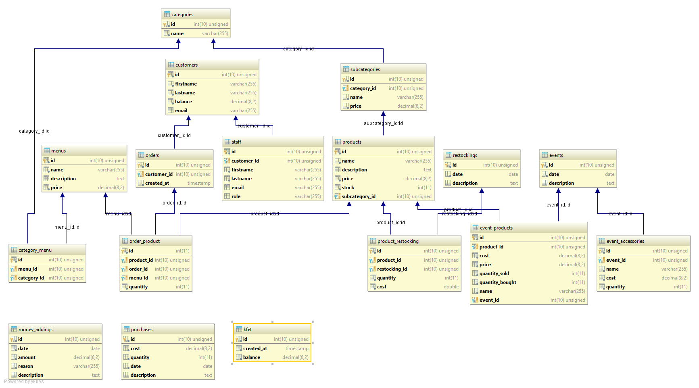

# Database goal
The goal is to allow the user to keep a trace of every change.

To achieve this, the different cases of sales and of purchases are 
scattered in many DB tables, which update the global balance value of the 
<code>kfet</code> table thanks to MySQL triggers.

## The DB tables:

### kfet

The <code>kfet</code> table represents the last update of the balance value of the kfet.

### purchases

The <code>purchases</code> table represents the history of purchases. 
For example, a new furnace....

The kfet balance amount is updated thanks to MySQL trigger.

### money_addings

The <code>money_addings</code> table is here if the users need to punctually add money 
to the account. Typically, it's here if I've done wrong job.

The kfet balance amount is updated thanks to MySQL trigger.

### events

The <code>events</code> table allows the user to plan events, which need accessories, 
an where/when some products are sold.

### event_accessories

The <code>event_accessories</code> table stores the needed accessories for a specific event. 
It possesses a unit price, and a quantity.

The kfet balance amount is updated thanks to MySQL trigger.

### event_products

The <code>event_products</code> table stores the products that will be during an event.
It informs the quantity bought, the unit purchasing cost, the quantity sold and at what price.
It can also, of course, be a standard product, with a foreign key to the <code>products</code> table.

### restockings

The <code>restockings</code> table is an history of all stock fillings. It simply 
possessed a date.

### product_restocking

The <code>product_restocking</code> table stores an history of the restockings per product.
It informs a unit cost, and a quantity.

The kfet balance account is updated thanks to MySQL triggers.

### products

The <code>products</code> stores all the products that are sold. A product possesses
a unit price, a name, a stock, and is part of a subcategory.

### subcategories

The <code>subcategories</code>, everything is is the name, is a sub-category.
For example, the category "hot dish" could possesses the subcategories "pizza", 
"frozen prepared dished", ect...

A subcategory can possess a price, which can be applied to all of its products.

### categories

The <code>categories</code> is simply a list of all products categories

### menus

The <code>menus</code> table contains the list of the menus that are sold.
A menu has a price, and a name.

A menu is composed by an item of several categories.

For example, the most basic menu could be dish + drink + crisps.
A dish is a category, itself composed by "frozen prepared dish", "pizza" subcategories...

### category_menu

The <code>category_menu</code> table is where the compositions of menus are stored. It's in this table 
that "The menu 'menu1' is constituted of a dish, a drink and a crisps"

### customers

The <code>customers</code> table stores all the cafetaria's customers who asked to have
an account, with a credit.

Therefore, they have a balance value, which they can use instead of paying at each 
purchase.

### orders 

The <code>orders</code> table contains the complete purchase history.

A purchase can concern a (or some) product(s), or a menu, with a quantity.

If the customer is recorded in the <code>customers</code> table, his ID is put, otherwise,
the field <code>customer_id</code> remains NULL.

### staff

The <code>staff</code> table is a a list of the official members of the cafeteria
For example, the president, the communication manager etc...
